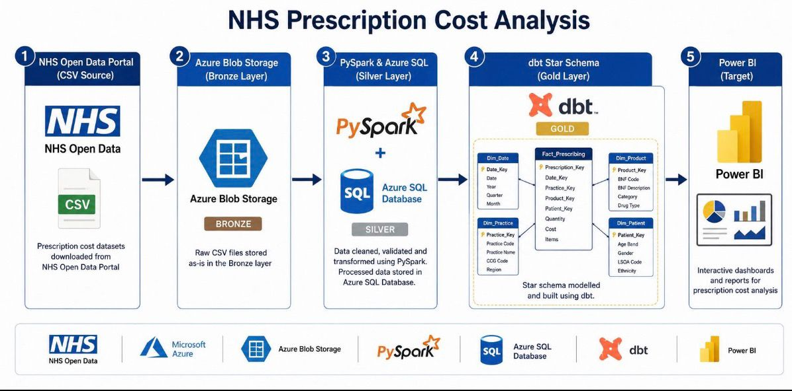
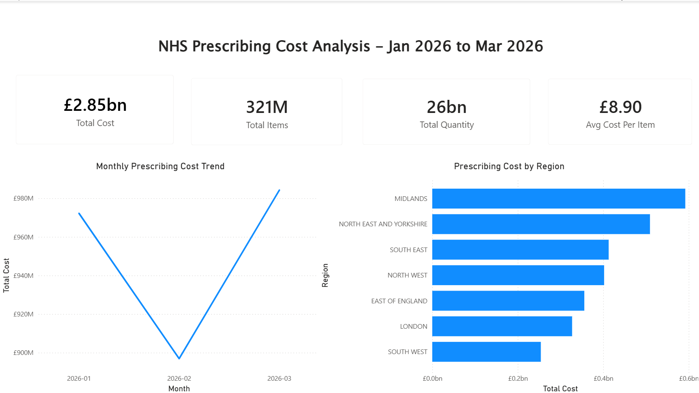

# NHS Prescription Cost Analysis Pipeline

> An end-to-end ELT data engineering portfolio project processing **3.4M+ rows** of NHS prescription data (~**£2.85bn** in spend) using a cloud-native Medallion architecture on Azure.

---

## Table of Contents

- [Project Overview](#project-overview)
- [Architecture](#architecture)
- [Project Structure](#project-structure)
- [Dataset](#dataset)
- [Tech Stack](#tech-stack)
- [Prerequisites & Requirements](#prerequisites--requirements)
- [Environment Setup](#environment-setup)
- [Step-by-Step Execution](#step-by-step-execution)
- [Power BI Dashboard](#power-bi-dashboard)

---

## Project Overview

This project builds a production-style ELT pipeline on Azure to process NHS Prescription Cost Analysis (PCA) data published monthly by the NHS Business Services Authority (NHSBSA).

The pipeline ingests raw CSVs from the NHSBSA Open Data Portal, transforms them through Bronze → Silver → Gold layers using PySpark and dbt, orchestrates everything with Apache Airflow, and surfaces insights through a Power BI dashboard.

**Key metrics:**
- 3.4M+ rows of prescription data processed
- ~£2.85bn in total prescription spend analysed
- Medallion architecture (Bronze / Silver / Gold)
- Kimball star schema in the Gold layer
- Fully orchestrated via Apache Airflow DAG

---

## Architecture



---

## Project Structure

```
nhs-pca-pipeline/
│
├── ingestion/           
│   ├── download_pca.py          
│   ├── upload_bronze_to_blob.py     
│   └── upload_silver_to_blob.py      
│
├── transformation/                 
│   ├── clean.py                     
│   ├── scheme.py                
│   └── spark_session.py              
│
├── gold/                         
│   ├── models/
│   │   └── gold_layer/
│   │       ├── dim_bnf.sql  
│   │       ├── dim_region.sql       
│   │       ├── dim_time.sql          
│   │       ├── fact_prescriptions.sql 
│   │       ├── schema.yml          
│   │       └── sources.yml                        
│   ├── tests/                      
│   ├── dbt_project.yml       
│   └── packages.yml                  
│
├── orchestration/                   
│   ├── dags/                         
│   ├── config/                        
│   ├── plugins/                      
│   ├── docker-compose.yaml            
│   ├── Dockerfile                    
│   └── requirements.txt          
│
│
│
├── load_silver_to_sql.py             
├── run_ingestion.py                  
├── run_silver.py                      
├── requirements.txt                   
└── README.md
```

---

## Dataset

**Source:** [NHSBSA Open Data Portal — Prescription Cost Analysis](https://opendata.nhsbsa.net/dataset/prescription-cost-analysis-pca-monthly-data)

The NHSBSA publishes monthly PCA data as CSV files detailing every prescription dispensed in England, broken down by BNF (British National Formulary) code, dispensing contractor, and NHS region.

**Key fields in raw data:**

| Field | Description |
|---|---|
| `YEAR_MONTH` | Period (YYYYMM format) |
| `REGIONAL_OFFICE_NAME` | NHS regional office |
| `ICB_NAME` | Integrated Care Board name |
| `BNF_CHEMICAL_SUBSTANCE` | Drug chemical substance |
| `BNF_DESCRIPTION` | BNF product description |
| `BNF_CODE` | 15-character BNF code |
| `ITEMS` | Number of prescription items |
| `QUANTITY` | Total quantity dispensed |
| `ACTUAL_COST` | Actual cost to NHS (£) |

**How data is fetched:**
The pipeline uses the NHSBSA API to dynamically discover available months and download the corresponding CSV resources — no hardcoded URLs.

> ⚠️ Monthly files can be large. Ensure you have sufficient Azure Blob Storage capacity and local bandwidth when running ingestion for multiple months.

---

## Tech Stack

| Layer | Technology |
|---|---|
| Ingestion | Python 3.10, NHSBSA REST API |
| Bronze / Silver storage | Azure Blob Storage + Delta Lake 3.2.0 |
| Transformations | PySpark 3.5 |
| Gold layer / modelling | dbt-core 1.7.2 + dbt-sqlserver 1.7.2 |
| Warehouse | Azure SQL Database |
| Orchestration | Apache Airflow 2.8.1 (Docker Compose) |
| Visualisation | Power BI Desktop (Import mode) |
| Containerisation | Docker + Docker Compose |
| Version control | Git + GitHub |

---

## Prerequisites & Requirements

### System Requirements

- Windows 10/11 (or Linux/macOS — note Windows-specific paths in `spark_session.py`)
- Docker Desktop (with WSL2 backend on Windows)
- Python 3.10+
- Java 11+ (required for PySpark — `default-jre-headless` installed in Docker image)
- Power BI Desktop (Windows only)

### Azure Resources Required

| Resource | Purpose |
|---|---|
| Azure Storage Account | Bronze and Silver Delta Lake storage |
| Azure Blob Container | `bronze/` and `silver/` prefixes |
| Azure SQL Server | `nhs-pca-server` |
| Azure SQL Database | `nhs-pca-gold` |

### Python Dependencies

Install locally (for running scripts outside Docker):

```bash
pip install -r requirements.txt
```

**`requirements.txt`** includes:

```
pyspark==3.5.0
delta-spark==3.2.0
dbt-core==1.7.2
dbt-sqlserver==1.7.2
apache-airflow==2.8.1
azure-storage-blob
pyodbc
pandas
requests
```

### ODBC Driver

Microsoft ODBC Driver 18 for SQL Server is required for Azure SQL connectivity.

- **Windows:** [Download from Microsoft](https://learn.microsoft.com/en-us/sql/connect/odbc/download-odbc-driver-for-sql-server)
- **Docker:** Installed automatically via the custom `Dockerfile`

---

## Environment Setup

### 1. Clone the repository

```bash
git clone https://github.com/rejisha/nhs-pca-pipeline.git
cd nhs-pca-pipeline
```

### 2. Create your `.env` file

> ⚠️ **Windows users:** Create the `.env` file with ASCII encoding to avoid Docker Compose parse errors.

```powershell
Set-Content -Encoding ascii .env @"
AZURE_STORAGE_CONNECTION_STRING=your_connection_string_here
AZURE_STORAGE_CONTAINER=your_container_name
AZURE_SQL_SERVER=nhs-pca-server.database.windows.net
AZURE_SQL_DATABASE=nhs-pca-gold
AZURE_SQL_USERNAME=nhs-pca-admin
AZURE_SQL_PASSWORD=your_password_here
"@
```

See `.env.example` for all required variables.

> 🔒 Never commit `.env` to version control. It is listed in `.gitignore`.

### 3. Build and start Airflow

```bash
docker-compose up --build -d
```

The custom Dockerfile extends `apache/airflow:2.8.1-python3.10` and installs:
- Java (`default-jre-headless`) for PySpark
- Microsoft ODBC Driver 18 for Azure SQL

### 4. Access the Airflow UI

Open [http://localhost:8080](http://localhost:8080) in your browser.

Default credentials: `airflow` / `airflow`

---

## Step-by-Step Execution

The pipeline is fully orchestrated via Airflow. You can also run each stage manually for development and debugging.

### Run via Airflow DAG 

1. Open the Airflow UI at `http://localhost:8080`
2. Enable the `nhs_pca_pipeline` DAG
3. Trigger a manual run using the ▶ button
4. Monitor the five tasks in sequence:

```
run_ingestion → run_silver → load_silver_to_sql → dbt_run → dbt_test
```

| Script | Description |
|---|---|
| `run ingestion.py`| Downloads monthly CSVs from NHSBSA API → writes to Bronze Delta Lake on Azure Blob |
| `run silver.py` | Reads Bronze Delta → cleans, casts types, deduplicates → writes Silver Delta |
| `load_silver_to_sql.py` | Reads Silver Delta → loads into Azure SQL staging tables |
| `dbt_run` | Builds Gold star schema (`dim_bnf`, `dim_region`, `dim_time`, `fact_prescriptions`) |
| `dbt_test` | Runs data quality tests (not-null, unique, referential integrity) |

### Run stages manually

**Ingestion (Bronze):**
```bash
python run_ingestion.py
```

**Silver transformation:**
```bash
python run_silver.py
```

**Load Silver → Azure SQL:**
```bash
python load_silver_to_sql.py
```

**dbt Gold models:**
```bash
cd dbt
dbt deps          # Install dbt packages (run before first dbt run and after clearing dbt_packages/)
dbt run           # Build Gold models
dbt test          # Run data quality tests
```

### Gold Layer Schema (Kimball Star Schema)

```
fact_prescriptions
 ├── bnf_id       → dim_bnf
 ├── region_id    → dim_region
 └── period       → dim_time
```

| Table 
|---|
| `fact_prescriptions` 
| `dim_bnf` 
| `dim_region` 
| `dim_time` 

---

## Power BI Dashboard

The Power BI report (`powerbi/nhs_pca_dashboard.pbix`) connects to the `nhs-pca-gold` Azure SQL database in **Import mode**.

**DAX measures:**

| Measure | Formula |
|---|---|
| Total Cost | `SUM(fact_prescriptions[actual_cost])` |
| Total Items | `SUM(fact_prescriptions[items])` |
| Total Quantity | `SUM(fact_prescriptions[quantity])` |
| Avg Cost Per Item | `DIVIDE([Total Cost], [Total Items])` |
| Number of Regions | `DISTINCTCOUNT(fact_prescriptions[region_id])` |

**Visuals included:**
- KPI cards: Total Cost (£), Total Items, Avg Cost Per Item, Number of Regions
- Monthly prescription cost trend (line chart)
- Cost by NHS region (bar chart)



---

## Author
*Rejisha Gopan Usha Kumari*
---

*Data sourced from the [NHS Business Services Authority Open Data Portal](https://opendata.nhsbsa.net/) under the [Open Government Licence v3.0](https://www.nationalarchives.gov.uk/doc/open-government-licence/version/3/).*
